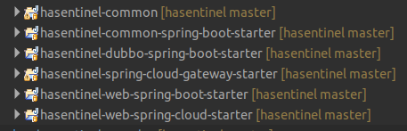
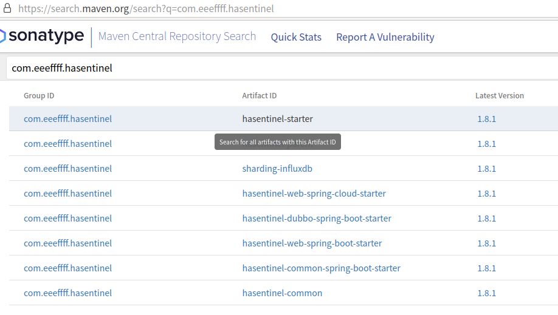

## 一、功能及架构介绍

HASentinel是基于阿里[Sentinel](https://github.com/alibaba/Sentinel)做的高可用、高可扩展改造的项目，主要改造点：

１、将配置改造为存储到Zookeeper中；

２、将应用上报的Metrics持久化存储到Influxdb集群中；

３、Metrics由Sentinel控制台主动获取，修改为由应用端主动上报；

４、优化Sentinel控制台的操作，将原来只能够针对应用的各个节点的配置操作，优化为针对应用本身的配置操作，然后应用到应用集群的所有节点；

５、增加Grafana做为报表展示，支持展示长时间的Metrics报表，并增加支持自动Influxdb集群数据路由的中间层ShardingInfluxdb；

HASentinel的架构图

.png")


## 二、支持多种环境的Starter



详细的使用见下面的文档介绍。


## **三、基础环境搭建**

**１、Influxdb环境搭建**

通过Docker安装Influxdb

```shell
 docker pull influxdb 
--安装第一个节点 
docker run -d -p 18083:8083 -p18086:8086 --name influxDbService1 influxdb 
--安装第二个节点 
docker run -d -p 28083:8083 -p28086:8086 --name influxDbService2 influxdb      
```

 连接到Influxdb中，两个节点中都创建名为“sentinel_db”的数据库：

```shell
fenglibin$ influx -host 127.0.0.1 -port 18086
Visit https://enterprise.influxdata.com to register for updates, InfluxDB server management, and monitoring.
Connected to http://127.0.0.1:28086 version 1.7.9
InfluxDB shell version: 1.1.1
> show databases;
name: databases
name
----
_internal
> create database sentinel_db
> use sentinel_db
Using database sentinel_db
> show measurements
> 
```

**２、Zookeeper搭建**

通过Docker安装Zookeeper。

```shell
docker pull zookeeper
docker run -d --name zookeeper --p 2181:2181  -d zookeeper
```

在ZK中创建如下节点：

```shell
SENTINEL-GROUP
    -APP-MACHINES
    -AUTHORITY-RULES
    -DEGRADE-RULES
    -FLOW-RULES
    -HOT-RULES
    -SYSTEM-RULES
```

具体操作如下：

执行ZK的客户端命令进入控制台：

```shell
 $zkCli.sh   
```

在控制台通过创建节点的命令创建节点：

```shell
[zk: localhost:2181(CONNECTED) 1] create /SENTINEL-GROUP
Created /SENTINEL-GROUP
[zk: localhost:2181(CONNECTED) 2] create /SENTINEL-GROUP/APP-MACHINES
Created /SENTINEL-GROUP/APP-MACHINES
...
```

**３、Redis搭建**

通过Docker安装Redis。

```
 docker pull redis docker run -d --name 
 redis -p 6379:6379 redis          
```

 **文档比较多还没有搬过来，详细架构文档及使用文档参看链接**：[https://note.youdao.com/s/ZlizPHkV](https://note.youdao.com/s/ZlizPHkV)


## 四、最新版本

最新的版本为1.8.2（以下截图未替换，只做示例）：


